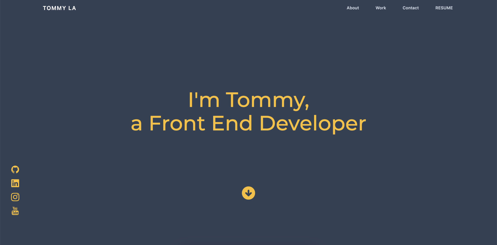

# TL Portfolio

My new portfolio for the year 2022. Newly designed and responsive.

## Preview

## Demo & Repository

- [Github Repo](https://github.com/latommyla/My-Portfolio)
- [GitHub Deployed Live URL](https://latommyla.github.io/TL-Portfolio/)

## Description 

Revising my old portfolio by starting completely from scratch and trying new things. Changed the structure and layout completely while using new technologies and styles that I've learned.

## What was used in this portfolio?

- HTML
- [Tailwind CSS](https://tailwindcss.com/)
- [Node.js](https://nodejs.org/en/)

## Process

Tailwind CSS was a new framework that I recently learned and wanted to hone my skills using it. Was a very tough but enjoyable learning experience and grateful that I took the chance to learn it. Very fun and easy framework to use once you get the hang of it. This entire portfolio is created only using Tailwind CSS but also regular CSS skills.

## Contact 

- [My GitHub](https://github.com/latommyla)
- [My Email](mailto:tommyl.dmd@gmail.com)
- [Instagram](https://instagram.com/latommyla)

